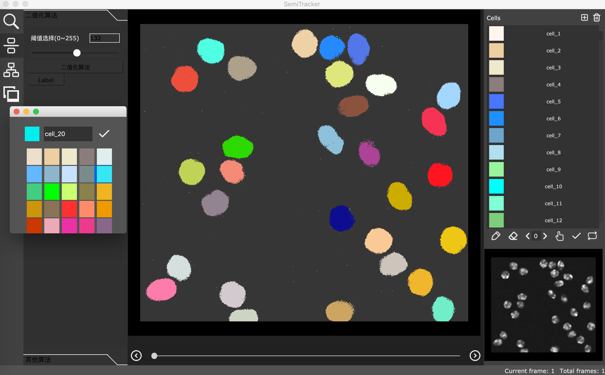

# Semi-Tracker, a User-friendly Semi-automatic Software for Multiple Cell Segmentation and Tracking

By [Tao Hu](https://gitlab.com/ecart18) & [Shixiong Xu](https://gitlab.com/xsx1001).

The code for the official implementation of **Semi-tracker**. 

## Contents
1. [Introduction](#introduction)
2. [Environment Setup](#environment-setup)
3. [Bibtex](#bibtex)

## Introduction <a name="introduction">
SemiTracker is a highly integrated graph user interfaces software for the cell segmentation and tracking of time-lapse microscopy image. It covers essential steps for full analyzing procedure of microscopy image, including project management, image pre-processing, cell segmentation and tracking, manual correction and downstream statistical analysis such as cell property profiling and intensity quantification. Semi-tracker supports data annotation and model training from scratch, which provides a more flexible and scalable solution for customized datasets.

<div align='center'><br></div>


## Environment Setup <a name="environment-setup">

**Env Requirements:** 
- MAC OS, Linux or Windows.
- Python 3.5+.
- PyTorch 1.4 or higher.
- CUDA 9.0 or higher if you need train deep learning model.

0. Install Python ref to [PYPT]()

1. Install SemiTracker in virtualenv to keep your environment clean:

    #### on macOS/Linux
    ```
    pip install virtualenv
    virtualenv --python=python3 SemiTrackerEnv
    cd SemiTrackerEnv
    source ./bin/activate
    ```
    Shutdown virtual environment with
    ```
    deactivate
    ```

    #### on Windows
    ```
    pip install virtualenv
    virtualenv --python=python3 SemiTrackerEnv 
    cd SemiTrackerEnv
    .\Scripts\activate.bat
    ```
    Shutdown virtual environment with
    ```
    .\Scripts\deactivate.bat
    ```

2. Download or clone the source codes with git. 
    ```
    git clone https://gitlab.com/ecart18/semitracker.git
    ```

3. Extract files and put it in the virtual environment directory you defined. The directory of SemiTracker should have the following structure:
    
    ```
    SemiTrackerEnv
        semitracker
            |-------main.py
            |
            |-------semi_tracker
                    |...
                    |...
            |-------datasets
                    |...
            |-------output
            |-------log
            |...
        |...
    ```

4. After the extraction, download all dependency with one commend.
    ```
    cd semitracker
    pip install -r requirements.txt
    ```

5. Run SemiTracker with python and enjoy it. 
    ```
    python main.py
    ```
    

## Bibtex<a name="bibtex">
Please consider citing our paper in your publications if the project helps your research. BibTeX reference is as follows.

```
@article{hu2020semi,
  title={Semi-tracker: An Automated Toolbox for Single-cell Segmentation and Tracking in Microscopy Images},
  author={Hu, Tao and Xu, Shixiong and Wang, Xiaowo},
  journal={arXiv preprint arXiv:2003.02795},
  year={2020}
}
```

## License
For academic use, this project is licensed under the GNU Lesser General Public License v3.0 - see the LICENSE file for details. For commercial use, please contact the authors. 